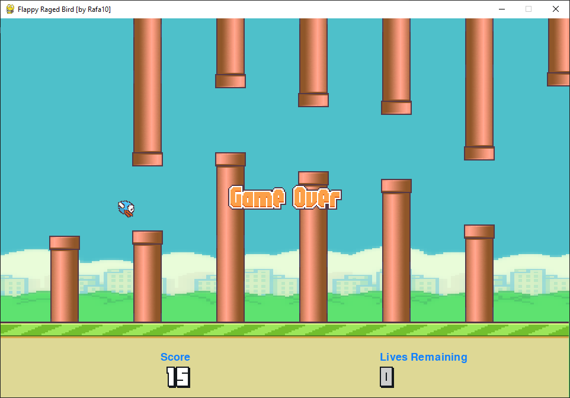

FlapPyBird
===============

A Flappy Bird Clone made using [python-pygame][pygame]

1 - Updated to Arcade Mode WideScreen (Multi Resolution)
1.1 - Auto resize to DeskTop Width // 2
2 - Add with Fury mode
3 - Display Crashes Number as Lives Remmaning (Limitted to 10)
3.1 - Add color change to Diplay Lives Remmaning
4 - Sound volume decreased to 20%
5 - Add Font to Diplay Text (Will use Default OS Font)

How-to (as tested on MacOS)
---------------------------

1. Install Python 3.x (recommended) 2.x from [here](https://www.python.org/download/releases/)

1. Install [pipenv]

1. Install PyGame 1.9.x from [here](http://www.pygame.org/download.shtml)

1. Clone the repository:

   ```bash
   $ git clone https://github.com/ChackBR/FlapPyBird
   
   ```

   or download as zip and extract.

1. In the root directory run

   ```bash
   $ pipenv install
   $ pipenv run python flappy.py
   ```

1. Use <kbd>&uarr;</kbd> or <kbd>Space</kbd> key to play and <kbd>Esc</kbd> to close the game.

(For x64 windows, get exe [here](http://www.lfd.uci.edu/~gohlke/pythonlibs/#pygame))

Notable forks
-------------

- [Fork From](https://github.com/sourabhv/FlapPyBird)
- [FlappyBird Fury Mode](https://github.com/Cc618/FlapPyBird)
- [FlappyBird Model Predictive Control](https://github.com/philzook58/FlapPyBird-MPC)
- [FlappyBird OpenFrameworks Port](https://github.com/TheLogicMaster/ofFlappyBird)
- [FlappyBird On Quantum Computing](https://github.com/WingCode/QuFlapPyBird)

Made something awesome from FlapPyBird? Add it to the list :)


ScreenShot
----------



[pygame]: http://www.pygame.org
[pipenv]: https://pipenv.readthedocs.io/en/latest/
